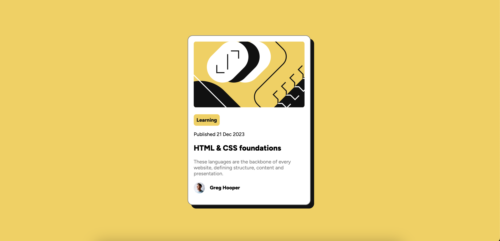
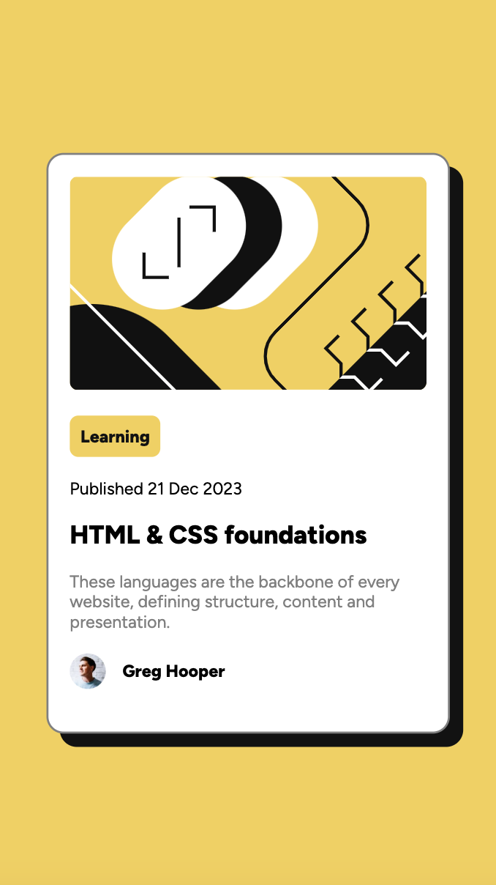

# Frontend Mentor - Blog preview card solution

## Table of contents

- [Overview](#overview)
  - [The challenge](#the-challenge)
  - [Screenshot](#screenshot)
  - [Links](#links)
- [Author](#author)

## Overview

This is the solution of Frontend mentor challenge of creating a blog preview card using html and css.

### The challenge

Users should be able to:

- See hover and focus states for all interactive elements on the page

### Screenshot

### Links

- Solution URL: https://github.com/DivyaB28/blog-preview-card
- Live Site URL: https://divyab28.github.io/blog-preview-card/

### Built with

- Semantic HTML5 markup
- CSS custom properties
- Flexbox

## Author

- Website - [Divya Basavaraju](https://divyab28.github.io/blog-preview-card/)
- Frontend Mentor - [@DivyaB28](https://www.frontendmentor.io/profile/DivyaB28)
- LinkedIn - [www.linkedin.com/in/divya-basavaraju](www.linkedin.com/in/divya-basavaraju)
